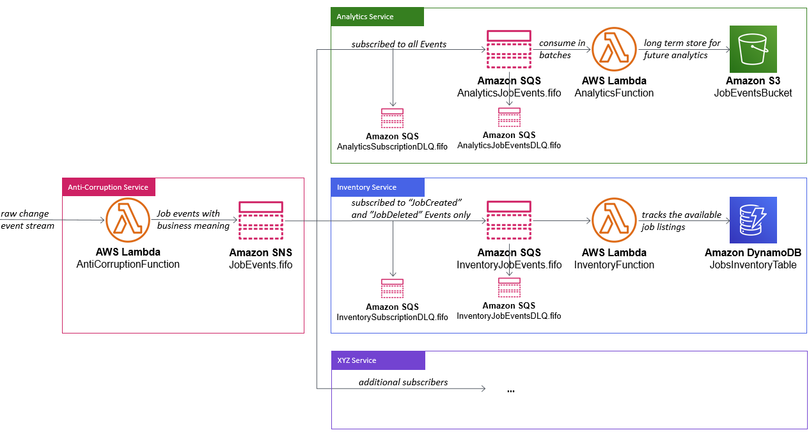

# Building event-driven architectures with Amazon SNS FIFO

This repository contains the sample recruiting agency application we introduce in our blog post [Building event-driven architectures with Amazon SNS FIFO](https://aws.amazon.com/blogs/compute/building-event-driven-architectures-with-amazon-sns-fifo/).

## Architectural Overview

There are 3 services in the architecture:

1. Anti-Corruption Service (event producer)
2. Inventory Service (event consumer)
3. Analytics Service (event consumer)



For more details of the individual components please refer to the associated Blog Post [Building event-driven architectures with Amazon SNS FIFO](https://aws.amazon.com/blogs/compute/building-event-driven-architectures-with-amazon-sns-fifo/).

## Deployment Guide

### Prequisites

For this walkthrough, you need the following prerequisites: 
* An [AWS account](https://aws.amazon.com/premiumsupport/knowledge-center/create-and-activate-aws-account/)
* [Python 3](https://realpython.com/installing-python/)
* [PIP](https://pip.pypa.io/en/stable/installing/)
* [AWS SAM CLI](https://docs.aws.amazon.com/serverless-application-model/latest/developerguide/serverless-sam-cli-install.html)

### Step 1: Deploy the CloudFormation Stack

We use [AWS SAM](https://aws.amazon.com/serverless/sam/) to build and deploy our sample application, using infrastructure as code: 

```bash
git clone https://github.com/aws-samples/event-driven-architecture-with-amazon-sns-fifo.git
cd event-driven-architecture-with-amazon-sns-fifo
sam build
```

To deploy the application, run:
```bash
sam deploy --guided
```

### Cleanup

To avoid additional cost, ensure that the provisioned resources are decommissioned. To do that, first remove all files stored in the Amazon S3 bucket, associated with the sample application. Then run the following command:

```bash
aws cloudformation delete-stack --stack-name <YOUR STACK NAME>
```

## License

This library is licensed under the MIT-0 License. See the LICENSE file.
